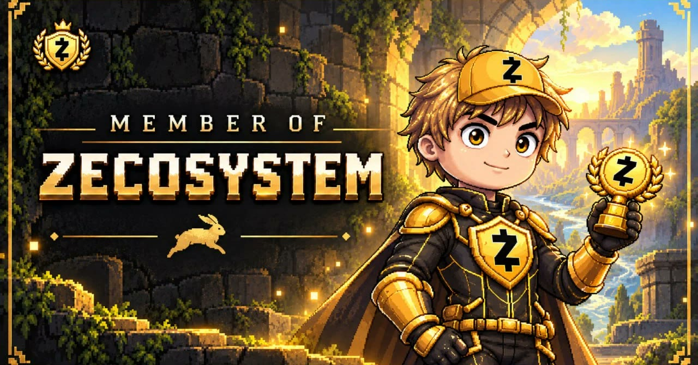

# Follow the Golden Rabbit

**Live: [zecosystem.info](https://zecosystem.info)** · built for the ZECATHON Wildcard track



A scroll-driven pixel-art story that onboards people to Zcash. A clueless grey kid wanders a park full of
red-eyed cameras until a golden rabbit with a pocket watch runs past. Follow it down the rabbit hole and,
floor by floor, he (and you) learns to keep money private: a real wallet, real ZEC, what the chain can and
can't see, and a real shielded payment that comes back with change. Each floor ends with a chest and a new
piece of gear, until he comes out the other side a **Member of Zecosystem**.

Best on a desktop or laptop: the story wants a cursor and a wide screen, so phones get a short page that
sends the link to a computer.

## The trip

| Where | What you learn | What you do |
| --- | --- | --- |
| **The surface** | Everything here is watched | Scroll after the golden rabbit and dive into its burrow |
| **Floor I · The Wallet Vault** | A shielded wallet keeps your balance and payments private | Install a wallet (Zodl, YWallet, Zingo) and paste your `u1…` address; it is checked with its Bech32m checksum right in the browser |
| **Floor II · The Old Mint** | Exchanges usually pay out to transparent `t1…` addresses | Get a little ZEC, and learn to shield it |
| **Floor III · The Harbor** | What a block explorer sees for the same payment sent transparent, shielding, and fully shielded (Ironwood) | Play the watcher on a battleship-style radar: transparent payments blip and sink, leaking addresses, amounts and balances. Then the shielded ones are shown to you, and every hit bounces off: found, hit, nothing learned |
| **The ferryman** | Sending and receiving, privately | Pay the ferryman **0.0002 ZEC** from your shielded balance with a memo only he can read (a ZIP-321 QR fills it in). His wallet sees it and sends **0.0001 ZEC** change back to the address from Floor I |
| **The other shore** | All of the above | A five-question exam at the oracle, then the change into the Member of Zecosystem and a card to share |

The golden rabbit guides every floor and opens each quest with a short lesson video. Quests that need a
wallet or coins can be skipped, so anyone (judges included) can see the whole story; the exam and the
battleship can't, since they only need what you just learned.

## How it's built

- **Site:** Vite and plain JavaScript, no framework. Two stacked canvases: one at device resolution for the
  painted rooms and props, one at the character's pixel scale, upscaled without smoothing. Lenis smooths the
  scroll, and every scene is a pure function of scroll progress, so scrolling back rewinds it. Quest panels
  hold the scroll until they're done. Progress lives in `localStorage` only.
- **Art:** every image and animation is AI-generated (image and video models) and processed by the scripts in
  [`tools/`](tools): sprite sheets from green-screen videos (with a gaze map so the kid's head follows your
  cursor), true-pixel-grid detection for low-res pose sheets, walk-cycle measurement so feet don't slide,
  ground-line and light detection for backgrounds.
- **The ferryman's wallet:** [`server/`](server) is a small dependency-free Node API next to a
  [zingo-cli](https://github.com/zingolabs/zingolib) light wallet on its own VPS. zingo-cli v6 goes online
  only through the Nym mixnet, so the box never shows its IP to the indexer. Each visitor gets a memo code;
  a watch loop reads the wallet's memos, matches the code and sends the change once per session. It runs as
  its own locked-down user behind Caddy (HTTPS), and only ever holds pocket change. See
  [`server/README.md`](server/README.md).

## Run it

```bash
npm install
npm run dev      # http://localhost:5173
npm run build    # static site in dist/
```

Without `VITE_FERRY_API` set, the ferry scene says its wallet isn't connected and shows no address to pay.
With it (e.g. `VITE_FERRY_API=https://api.zecosystem.info`), it talks to the ferryman's server.

## Privacy

No analytics, no accounts, no cookies (fonts come from Google Fonts). Of everything you type, only the
shielded address you give the ferryman leaves your browser: it goes to his server so your change can come
back, and stays there with your session.

## Made by

- [@nefiten](https://x.com/nefiten)
- [@0xumutcan](https://x.com/0xumutcan)
